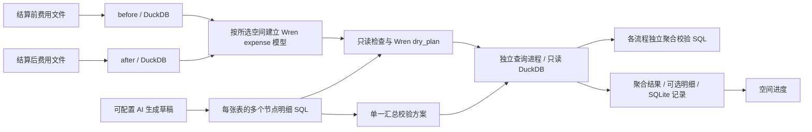

# CloseWren 当前整体设计

本文件以当前需求为准：结算前、结算后、后续三大表及标准参考表统一展示，底层数据按表隔离；工作区只维护一份汇总校验方案。数据源、校验轨道和校验节点相互解耦。

## 一、已运行的 Demo

数据源由 `data/source-config.json` 注册，可不限数量新增。每个数据源拥有稳定 ID、显示名称、用途、SQL 表名、文件夹和文件名匹配条件。查询时 `expense` 指向节点所属主表，只将当前主表和全部标准参考表加入该流程的只读 Wren 工作区。其他流程主表不可见。聚合 SQL 查询该流程节点提供的 rule_detail。

导入字段不做业务别名归并，识别单元格坐标和共享字符串，保留原始列名及来源行号。金额字段先扫描精度再建立十进制列；无法无损容纳的数值保留原文本并提示。文件 hash 用于重复启动时避免重复导入。

本版保留当前导入数据与来源指纹；不是完整的多历史批次系统。重新导入同一空间会替换本机该空间的工作库；原始文件仍位于来源目录，用户若需要历史文件，应另外留存。旧运行保留其数据指纹，界面将其标识为历史版本，不能视为当前通过。

## 二、WrenAI 的实际职责

使用 `wren.engine.WrenEngine`，为当前数据集动态建立 MDL：`expense → main.raw_expense`。每个中文字段均显式提供类型。通过 `dry_plan` 执行真实语义展开，之后在独立、受限制的 DuckDB 连接执行展开 SQL。

没有伪造 Wren 服务。Wren 也不负责决定费用是否正确。大模型通过应用 API 生成草稿，Wren 负责规划和技术校验；用户规则与进度由本应用管理。

当前使用语法树白名单、当前模型限制、Wren strict mode、展开后二次检查、只读数据库、关闭外部访问与子进程超时。查询失败明确报错，不回退到模拟数据。暂未提供复杂原生 SQL 绕过语义层的通道。

## 三、功能与状态语义

| 功能 | 已实现 | 后续业务阶段 |
|---|---|---|
| 文件接入 | 已有两份真实报表分别导入、字段目录、指纹、来源行号 | 任意文件上传、模板配置、批次历史与归档 |
| 手工 SQL | Ace 高亮、字段补全、格式化、字段插入和结果预览 | 参数管理、复杂 SQL 适配 |
| AI | 编辑器内生成/解释/修复 SQL，支持 Responses、Chat Completions、Anthropic 与 CC Switch；草稿经过字段契约和 Wren 规划检查 | 内网模型连通验证、业务案例评估、知识检索 |
| 规则 | 聚合 SQL 输出“校验金额”，可配明细 SQL 与容差，各空间隔离 | 正式修订版本、发布/撤销、规则依赖和权限 |
| 运行记录 | 全量逐组判定、未归零组预览、可选明细、CSV 下载、数据指纹 | 全量异常台账、批量调度、重试、分工 |
| 进度 | 一条规则一个节点，展示待运行/通过/不通过/错误 | 根据业务规则定义结账总门禁与复核责任人 |
| 凭证与修源 | 尚未实现 | 用户定义场景后实现证据、凭证状态与处置闭环 |
| 多人协作 | 当前仅本机单用户 | 内网部署、认证、事业部权限、审计与备份 |

方案只保存一段通用聚合校验 SQL，查询固定输入 `rule_detail`。方案可包含任意多条校验轨道；每条轨道指定一张校验主表并包含任意多个节点，同一主表可用于多条轨道，标准参考表可以没有轨道。系统逐节点把其明细 SQL 包装为 `rule_detail` 后执行通用聚合 SQL。聚合输出中除 `校验金额` 外的列自动作为下钻维度。运行记录保存所有工作区数据表的内容指纹，任何参与环境中的表刷新后，旧结果均不能按新数据重新导出。

## 四、主要 API

| 接口 | 用途 |
|---|---|
| GET /api/bootstrap | 两个数据集元数据、引擎状态、模型是否配置、规则和执行记录 |
| GET /api/preview?dataset_id=before | 当前空间预览 |
| POST /api/query | 对所选空间执行只读 SQL，完整计数及有限预览 |
| POST /api/rules | 保存用户填写的规则 SQL，先做 Wren 规划验证 |
| POST /api/rules/{id}/run | 执行指定规则，持久化运行记录 |
| DELETE /api/rules/{id} | 删除规则定义，保留运行历史 |
| POST /api/ai/generate | 调用已配置模型，返回 SQL 草稿，不自动执行 |
| GET /api/health | 本机服务健康检查 |
| POST /api/shutdown | 本机停止脚本使用的服务关闭入口 |

## 五、后续向正式系统扩展

继续使用独立空间或阶段标识，增加期间、事业部、责任人与数据批次。三张报表和辅助表分别建模；只有业务明确需要关联时才增加关系，不凭名称猜测。

多人阶段将报表和业务状态迁到 PostgreSQL，Wren 模型通过适配层指向新数据源。DuckDB 方言规则需在迁移时重新验证，不能保证零修改迁移。正式业务状态采用数据批次、规则版本、辅助表版本共同绑定，业务规则变化后可识别受影响运行。

权限在服务端及数据库执行层落实；前端事业部选择器仅用于操作，不承担授权。正式部署需认证、运行队列、全量结果留存、审计、备份及恢复验证。上述属于后续交付，并非本 Demo 已具备。

## 六、开发沟通约定

每个用户回合开始，先列出当前整体设计及相关细节，再说明本轮工作。用户未提供业务校验规则时，继续完成架构和通用能力，不要求先给规则，也不擅自补写规则。

## 2026-09-18 体验与管理配置

普通用户维护业务语义并查看规划；管理员通过密码解锁运行参数、模型定义和实现诊断。业务说明保存在 semantic_notes，管理员密码哈希与运行参数保存在 admin_settings。详情及尚未完成的能力见 EXPERIENCE_AUDIT.md。
